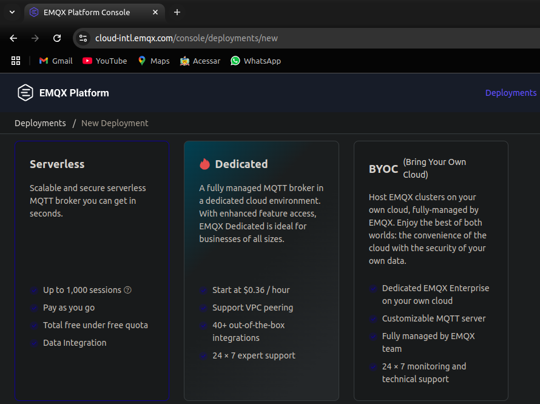
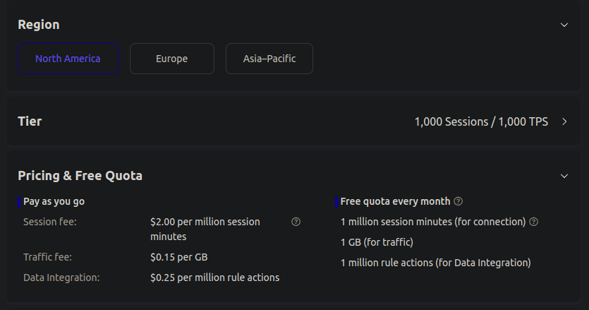
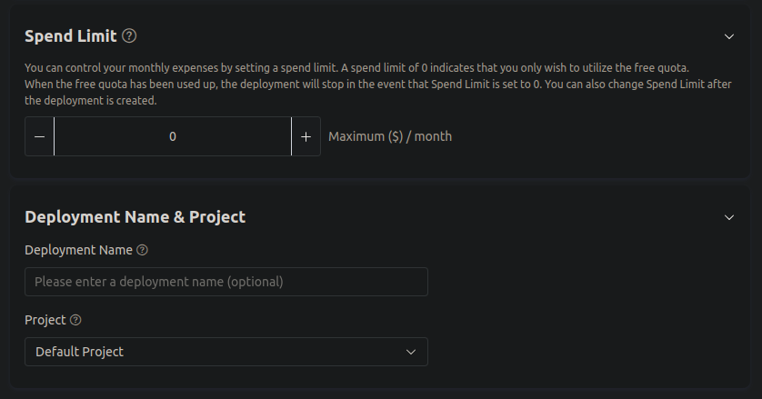
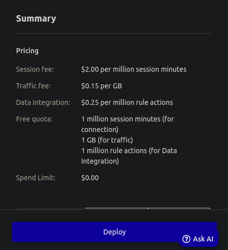
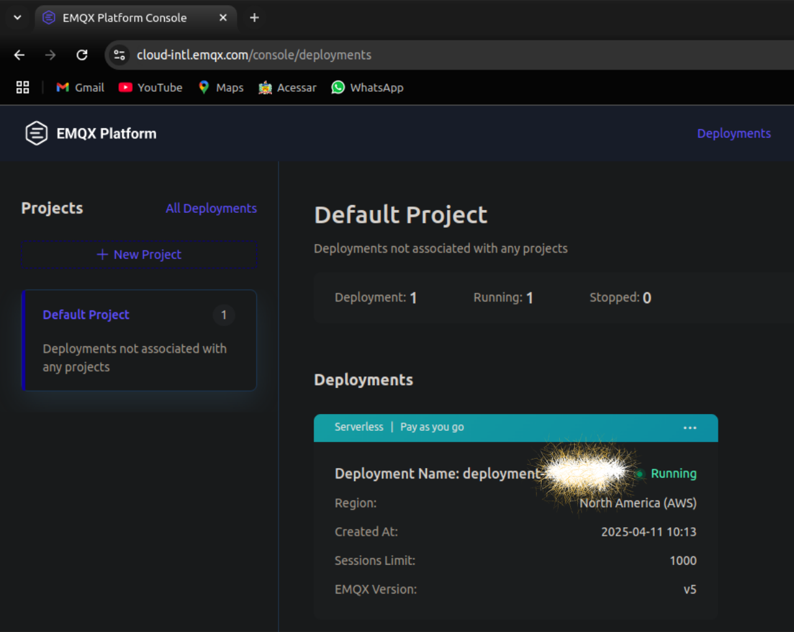
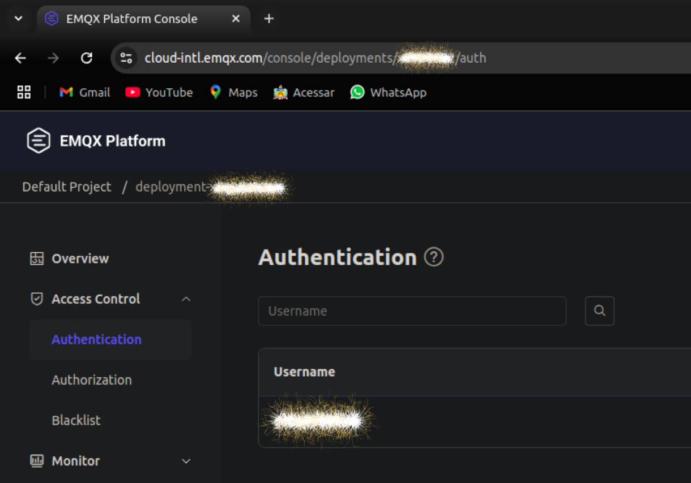
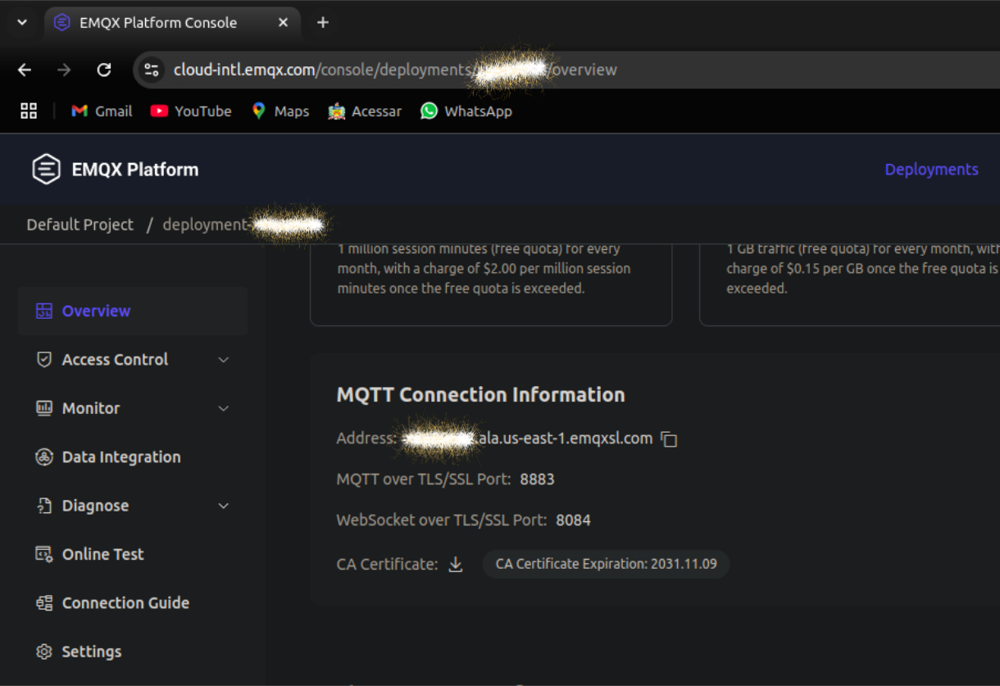
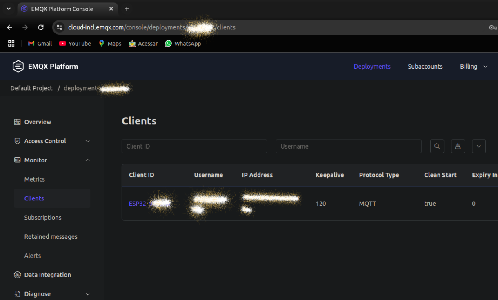
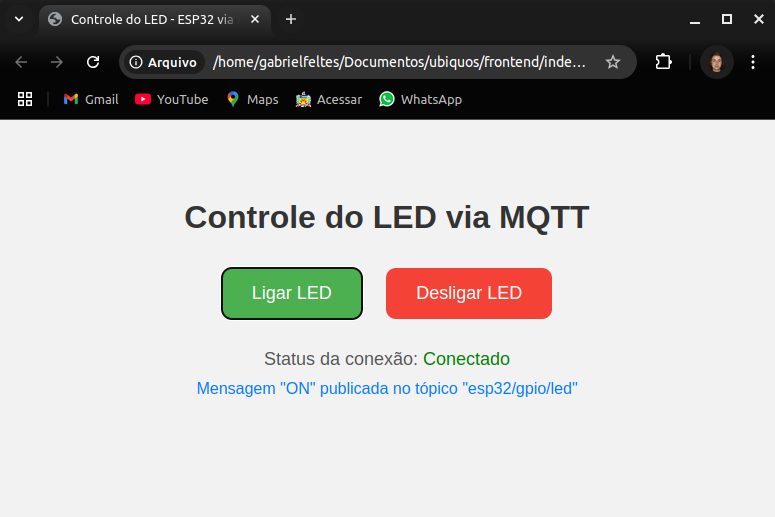

# Controle do ESP32 via EMQX: Comunicação Segura com MQTT em Nuvem

Este protótipo inicial foi projetado para controlar o LED embutido no ESP32, permitindo que ele seja ligado e desligado remotamente via MQTT. Essa funcionalidade básica serve como um ponto de partida para explorar o potencial do ESP32 em aplicações IoT.

A partir deste exemplo, é possível estender facilmente o projeto para integrar outros sensores e atuadores, como sensores de temperatura, umidade, ou até mesmo controlar dispositivos externos.

> **Nota:** Este tutorial foi desenvolvido e testado exclusivamente no sistema operacional **Ubuntu**. Caso utilize outro sistema, será necessário adaptar os comandos e configurações conforme as especificidades do seu ambiente.

## 1. Criar Conta no EMQX Cloud

Acesse o link para [**`CRIAR SUA CONTA`**](https://cloud-intl.emqx.com/console) no EMQX Cloud.

## 2. Criar um Deployment Serverless

  
Vá até o site da [**`EMQX Cloud`**](https://cloud-intl.emqx.com/console/deployments/new) e selecione a opção `Serverless`.

  
Escolha a região mais próxima de você. Neste exemplo, foi escolhida **`North America`**.

  
Note que, por padrão, o **`Spend limit`** mensal é de **0 dólares**, ou seja, você não precisará adicionar um método de pagamento. Dê um nome ao seu *Deployment*, se desejar.

  
Confira o *`Summary`*: Apesar de não ser um serviço com tráfego ilimitado, há uma **quantidade considerável de tráfego gratuito mensal** para seu broker MQTT em nuvem. Clique em **`Deploy`**.

## 3. Acessar Seu Deployment

  
Acesse [**`seu serviço rodando no EMQX Cloud`**](https://cloud-intl.emqx.com/console/deployments).

## 4. Criar Usuário e Senha para Autenticação

  
Clique no seu deployment e vá até a opção **`Authentication`** no menu suspenso **`Access Control`**.

Crie um **nome de usuário** e uma **senha** e guarde essas informações. Elas serão utilizadas no código para conectar seu **ESP32** à nuvem.

## 5. Preparar o Ambiente no Ubuntu (ou Adaptar para Seu Sistema)

Siga os passos de forma sequencial e no **mesmo terminal**. Este guia usa o terminal padrão do **Ubuntu**.

### Atualizar os pacotes e instalar dependências

```bash
sudo apt update

sudo apt install -y git wget flex bison gperf python3 python3-pip python3-setuptools cmake ninja-build ccache libffi-dev libssl-dev dfu-util
```

### Criar diretório para o ESP-IDF

```bash
mkdir -p ~/esp32
cd ~/esp32
```

### Clonar o repositório da ESP-IDF

Tenha cerca de 3GB livres em sua pasta pessoal antes de executar o comando:

```bash
git clone --recursive https://github.com/espressif/esp-idf.git
```

### Instalar o ESP-IDF e configurar o ambiente

```bash
cd esp-idf
./install.sh
. ./export.sh
```

### Configure seu terminal para ativar automaticamente o compilador `idf.py` ao trabalhar com o ESP32

Copie e cole o seguinte código no terminal para configurar o ambiente. Ele garantirá que o compilador `idf.py` seja ativado automaticamente apenas quando você estiver dentro da pasta `esp32` ou de suas subpastas:

```bash
cat << 'EOF' >> ~/.bashrc

# Auto-activate ESP-IDF when inside ~/esp32 or subfolders
auto_activate_espidf() {
    if [[ "$PWD" == "$HOME/esp32"* ]]; then
        if [[ -z "$IDF_PATH" || "$IDF_PATH" != "$HOME/esp32/esp-idf" ]]; then
            echo "🛠️  Activating ESP-IDF environment for $(basename "$PWD")..."
            source "$HOME/esp32/esp-idf/export.sh" > /dev/null 2>&1
        fi
    fi
}

# Adiciona a função ao PROMPT_COMMAND sem sobrescrever outros comandos
if [[ -z "$PROMPT_COMMAND" ]]; then
    PROMPT_COMMAND="auto_activate_espidf"
else
    PROMPT_COMMAND="auto_activate_espidf; $PROMPT_COMMAND"
fi
EOF

source ~/.bashrc
```

Após executar o comando acima, o ambiente ESP-IDF será ativado automaticamente sempre que você navegar para a pasta `esp32` ou suas subpastas no terminal.

#### Verifique a disponibilidade do compilador escrevendo o seguinte comando no terminal ativado dentro da pasta `esp32` ou subpastas

```bash
idf.py --version
```

### Testar o exemplo "Hello World"

```bash
cd
cd ~/esp32
cp -r esp-idf/examples/get-started/hello_world .
cd hello_world
```

Verifique que o `idf.py` foi ativado. Logo, rode:

```bash
idf.py build
```

Observe que a compilação deve ser bem-sucedida e pedir para conectar o ESP32.

## 6. Duplicar o projeto "Hello World" para customizar sua própria cópia do projeto

```bash
cd ~/esp32
cp -r hello_world esp32_mqtt_cloud
ls
```

Observe os arquivos listados e prossiga.

```bash
cd esp32_mqtt_cloud
ls
```

Observe os arquivos listados e prossiga.

```bash
cd main
ls
```

Observe os arquivos listados e prossiga.

### Adicionar o certificado de segurança do EMQX


Vá até a opção **`Overview`** do seu deployment e baixe seu certificado de segurança clicando ao lado de **`CA Certificate`**.

#### Mover o certificado para a pasta `main` do seu projeto

```bash
mv ~/Downloads/emqxsl-ca.crt ~/esp32/esp32_mqtt_cloud/main/
ls
```

Observe os arquivos listados e prossiga

#### Abra o arquivo `CMakeLists.txt` localizado na pasta `main` do projeto `esp32_mqtt_cloud` com seu editor preferido

##### Substitua todo o conteúdo do arquivo pelo código abaixo

```cmake
idf_component_register(SRCS "hello_world_main.c"
                       PRIV_REQUIRES 
                        nvs_flash 
                        esp_driver_gpio 
                        mqtt 
                        esp_wifi 
                        esp_event 
                        esp_netif
                       INCLUDE_DIRS "")

target_add_binary_data(${COMPONENT_TARGET} "emqxsl-ca.crt" TEXT)
```

`Salve e feche o arquivo.`

### Abra o arquivo `hello_world_main.c` da pasta `main` com seu editor preferido

#### Substitua todo o conteúdo do arquivo pelo código a seguir

```c
#include <stdio.h>
#include <string.h>
#include "freertos/FreeRTOS.h"
#include "freertos/task.h"
#include "esp_log.h"
#include "nvs_flash.h"
#include "driver/gpio.h"
#include "mqtt_client.h"
#include "esp_wifi.h"
#include "esp_event.h"
#include "esp_netif.h"

// Configurações Wi-Fi
#define WIFI_SSID "WIFI_SSID"
#define WIFI_PASS "WIFI_PASS"

// Configurações do LED
#define LED_GPIO GPIO_NUM_2

// Configurações do MQTT
#define MQTT_BROKER "mqtts://********.ala.us-east-1.emqxsl.com:8883"
#define MQTT_LED_TOPIC "esp32/gpio/led"
#define MQTT_STATUS_TOPIC "esp32/status"

// Intervalo de heartbeat (em milissegundos)
#define HEARTBEAT_INTERVAL 5000

// Variáveis globais
static const char *TAG = "MQTT_LED";
esp_mqtt_client_handle_t client;
TaskHandle_t heartbeat_task_handle = NULL;
static bool mqtt_connected = false;

// Referência ao certificado embedado
extern const uint8_t emqxsl_ca_crt_start[] asm("_binary_emqxsl_ca_crt_start");
extern const uint8_t emqxsl_ca_crt_end[]   asm("_binary_emqxsl_ca_crt_end");

// Tarefa para enviar heartbeat periódico
static void heartbeat_task(void *pvParameters) {
    while (1) {
        if (mqtt_connected) {
            esp_mqtt_client_publish(client, MQTT_STATUS_TOPIC, "heartbeat", 0, 0, 0);
            ESP_LOGI(TAG, "Heartbeat enviado");
        }
        vTaskDelay(pdMS_TO_TICKS(HEARTBEAT_INTERVAL));
    }
}

// Manipulador de eventos MQTT
static void mqtt_event_handler(void *handler_args, esp_event_base_t base, int32_t event_id, void *event_data) {
    esp_mqtt_event_handle_t event = event_data;

    switch ((esp_mqtt_event_id_t)event_id) {
        case MQTT_EVENT_CONNECTED:
            ESP_LOGI(TAG, "Conectado ao broker MQTT");
            mqtt_connected = true;
            
            // Publica que está online
            esp_mqtt_client_publish(client, MQTT_STATUS_TOPIC, "online", 0, 1, 0);
            
            // Se inscreve no tópico do LED
            esp_mqtt_client_subscribe(client, MQTT_LED_TOPIC, 0);
            
            // Cria a tarefa de heartbeat
            xTaskCreate(heartbeat_task, "heartbeat_task", 2048, NULL, 5, &heartbeat_task_handle);
            break;

        case MQTT_EVENT_DISCONNECTED:
            ESP_LOGI(TAG, "Desconectado do broker MQTT");
            mqtt_connected = false;
            if (heartbeat_task_handle != NULL) {
                vTaskDelete(heartbeat_task_handle);
                heartbeat_task_handle = NULL;
            }
            break;

        case MQTT_EVENT_DATA:
            ESP_LOGI(TAG, "Recebido %.*s: %.*s",
                     event->topic_len, event->topic,
                     event->data_len, event->data);

            // Verifica se a mensagem é para o tópico do LED
            if (strncmp(event->topic, MQTT_LED_TOPIC, event->topic_len) == 0) {
                if (strncmp(event->data, "ON", event->data_len) == 0) {
                    gpio_set_level(LED_GPIO, 1);
                    ESP_LOGI(TAG, "LED ligado");
                } else if (strncmp(event->data, "OFF", event->data_len) == 0) {
                    gpio_set_level(LED_GPIO, 0);
                    ESP_LOGI(TAG, "LED desligado");
                } else {
                    ESP_LOGW(TAG, "Comando inválido: %.*s", event->data_len, event->data);
                }
            }
            break;

        default:
            break;
    }
}

// Inicialização do Wi-Fi
void wifi_init_sta(void) {
    esp_netif_init();
    esp_event_loop_create_default();
    esp_netif_create_default_wifi_sta();

    wifi_init_config_t cfg = WIFI_INIT_CONFIG_DEFAULT();
    esp_wifi_init(&cfg);

    wifi_config_t wifi_config = {
        .sta = {
            .ssid = WIFI_SSID,
            .password = WIFI_PASS,
        },
    };

    esp_wifi_set_mode(WIFI_MODE_STA);
    esp_wifi_set_config(WIFI_IF_STA, &wifi_config);
    esp_wifi_start();
    esp_wifi_connect();
}

// Função principal
void app_main(void) {
    ESP_ERROR_CHECK(nvs_flash_init());

    // Inicializar LED
    gpio_reset_pin(LED_GPIO);
    gpio_set_direction(LED_GPIO, GPIO_MODE_OUTPUT);
    gpio_set_level(LED_GPIO, 0);

    // Conectar Wi-Fi
    wifi_init_sta();

    // Configurar cliente MQTT com certificado TLS
    esp_mqtt_client_config_t mqtt_cfg = {
        .broker = {
            .address.uri = MQTT_BROKER,
            .verification.certificate = (const char *)emqxsl_ca_crt_start,
        },
        .credentials = {
            .username = "AUTH_USERNAME",
            .authentication.password = "AUTH_PASSWORD",
        },
        .session = {
            .last_will = {
                .topic = MQTT_STATUS_TOPIC,
                .msg = "offline",
                .msg_len = 7, // "offline" tem 7 caracteres
                .qos = 1,
                .retain = 1,
            },
        },
    };

    client = esp_mqtt_client_init(&mqtt_cfg);
    esp_mqtt_client_register_event(client, ESP_EVENT_ANY_ID, mqtt_event_handler, NULL);
    esp_mqtt_client_start(client);
}
```

#### Substitua os seguintes valores no código acima

- **`WIFI_SSID`**: Insira o nome da sua rede Wi-Fi.

- **`WIFI_PASS`**: Insira a senha da sua rede Wi-Fi.

- **`MQTT_BROKER`**: Insira o endereço do broker MQTT fornecido pelo EMQX. Consulte a seção [**`3. Acessar Seu Deployment`**](#3-acessar-seu-deployment) para obter o endereço correto. Substitua os oito caracteres `********` pelo ID do seu deployment.

- **`AUTH_USERNAME`**: Insira o nome de usuário criado na etapa de autenticação do EMQX. Consulte a seção [**`4. Criar Usuário e Senha para Autenticação`**](#4-criar-usuário-e-senha-para-autenticação) para relembrar os detalhes.

- **`AUTH_PASSWORD`**: Insira a senha criada na etapa de autenticação do EMQX.

`Salve e feche o arquivo`

## 7. Compilar e Carregar o Código no ESP32

### Certifique-se de que você esteja aqui no seu terminal

```bash
cd ~/esp32/esp32_mqtt_cloud
```

#### Compile o código

Limpa-se o projeto e compila-se novamente para garantir que todas as dependências estejam atualizadas:

```bash
idf.py fullclean
idf.py build
```

#### Conecte seu ESP32 ao computador via USB e verifique a porta serial

```bash
ls /dev/ttyUSB*
```

#### Grave o código no seu ESP32 e monitore a saída

```bash
idf.py flash
idf.py monitor
```

Agora, você deve ver mensagens de log no terminal. O ESP32 tentará se conectar ao Wi-Fi e, em seguida, ao broker MQTT. Quando conectado, você verá a seguinte mensagem:
`MQTT_LED: Conectado ao broker MQTT`

## 8. Teste o controle do LED via MQTT

Agora, acesse a [`página de monitoramento de deployments`](https://cloud-intl.emqx.com/console/deployments). Selecione seu deployment ativo, clique na aba **`Clients`** no menu **`Monitor`**, e verifique se o cliente está conectado ao broker MQTT na nuvem.



### Crie um aplicativo MQTT com as ferramentas de front-end que você preferir

Isso permite que você controle o LED do seu ESP32 de qualquer lugar do mundo, desde que tenha acesso à internet. Além disso, você pode verificar o status da conexão tanto do ESP32 quanto do cliente MQTT. Como não só o ESP32, mas também o cliente MQTT, podem se desconectar, é importante verificar o status de ambos para que as ações sejam refletidas corretamente no hardware.

#### Segue aqui uma página HTML que controla o LED via MQTT

```html
<!DOCTYPE html>
<html lang="pt-BR">
<head>
  <meta charset="UTF-8">
  <title>Controle do LED - ESP32 via MQTT</title>
  <style>
    body {
      font-family: sans-serif;
      text-align: center;
      background: #121212;
      color: #e0e0e0;
      padding: 50px;
    }
    h1 {
      color: #ffffff;
    }
    button {
      font-size: 18px;
      padding: 15px 30px;
      margin: 10px;
      border: none;
      border-radius: 10px;
      cursor: pointer;
      transition: background 0.3s;
    }
    #onBtn {
      background-color: #388e3c;
      color: white;
    }
    #onBtn:hover {
      background-color: #2e7d32;
    }
    #offBtn {
      background-color: #d32f2f;
      color: white;
    }
    #offBtn:hover {
      background-color: #c62828;
    }
    #status {
      margin-top: 20px;
      font-size: 18px;
      color: #bdbdbd;
    }
    #esp32Status {
      margin-top: 10px;
      font-size: 18px;
      color: #bdbdbd;
    }
    #publishStatus {
      margin-top: 10px;
      font-size: 16px;
      color: #64b5f6;
    }
  </style>
</head>
<body>
  <h1>Controle do LED via MQTT</h1>
  <button id="onBtn">Ligar LED</button>
  <button id="offBtn">Desligar LED</button>

  <div id="status">Status da conexão: <span id="connection">Conectando...</span></div>
  <div id="esp32Status">Status do ESP32: <span id="esp32Connection">Desconhecido</span></div>
  <div id="publishStatus"></div>

  <script src="https://unpkg.com/mqtt/dist/mqtt.min.js"></script>
  <script>
    const options = {
      connectTimeout: 4000,
      clientId: 'web_client_' + Math.random().toString(16).substr(2, 8),
      username: 'AUTH_USERNAME',
      password: 'AUTH_PASSWORD',
    };

    const connectUrl = 'wss://********.ala.us-east-1.emqxsl.com:8084/mqtt';
    const client = mqtt.connect(connectUrl, options);

    const connectionElement = document.getElementById('connection');
    const esp32ConnectionElement = document.getElementById('esp32Connection');
    const publishStatusElement = document.getElementById('publishStatus');

    // Variável para controle do status do ESP32
    let esp32Online = false;
    let lastSeen = null;
    let checkInterval;

    client.on('connect', () => {
      console.log('Conectado ao broker MQTT via WebSocket');
      connectionElement.textContent = 'Conectado';
      connectionElement.style.color = '#4caf50';
      enableButtons(true);
      
      // Inscreva-se no tópico de status do ESP32
      client.subscribe('esp32/status', (err) => {
        if (err) {
          console.error('Erro ao se inscrever no tópico esp32/status:', err);
        } else {
          console.log('Inscrito no tópico esp32/status');
        }
      });
      
      // Configurar verificação periódica
      setupEsp32StatusChecker();
    });

    client.on('reconnect', () => {
      console.log('Tentando reconectar...');
      connectionElement.textContent = 'Reconectando...';
      connectionElement.style.color = '#ffb74d';
      enableButtons(false);
    });

    client.on('error', (err) => {
      console.error('Erro de conexão:', err);
      connectionElement.textContent = 'Erro de conexão';
      connectionElement.style.color = '#e57373';
      enableButtons(false);
    });

    client.on('offline', () => {
      console.warn('Cliente offline');
      connectionElement.textContent = 'Desconectado';
      connectionElement.style.color = '#e57373';
      enableButtons(false);
      clearInterval(checkInterval);
    });

    client.on('message', (topic, message) => {
      console.log(`Mensagem recebida no tópico ${topic}: ${message.toString()}`);
      
      if (topic === 'esp32/status') {
        const msg = message.toString();
        if (msg === 'online') {
          updateEsp32Status(true);
        } else if (msg === 'offline') {
          updateEsp32Status(false);
        } else if (msg.startsWith('heartbeat')) {
          updateEsp32Status(true);
          lastSeen = new Date();
        }
      }
    });

    function setupEsp32StatusChecker() {
      // Limpar intervalo anterior se existir
      if (checkInterval) clearInterval(checkInterval);
      
      // Verificar a cada 5 segundos se o ESP32 ainda está online
      checkInterval = setInterval(() => {
        if (lastSeen && (new Date() - lastSeen) > 10000) { // 10 segundos sem heartbeat
          updateEsp32Status(false);
        }
      }, 5000);
    }

    function updateEsp32Status(online) {
      esp32Online = online;
      if (online) {
        esp32ConnectionElement.textContent = 'Online';
        esp32ConnectionElement.style.color = '#4caf50';
        lastSeen = new Date();
      } else {
        esp32ConnectionElement.textContent = 'Offline';
        esp32ConnectionElement.style.color = '#e57373';
      }
      enableButtons(online && client.connected);
    }

    function enableButtons(enable) {
      const onButton = document.getElementById('onBtn');
      const offButton = document.getElementById('offBtn');
      if (enable) {
        onButton.disabled = false;
        offButton.disabled = false;
        onButton.style.cursor = 'pointer';
        offButton.style.cursor = 'pointer';
      } else {
        onButton.disabled = true;
        offButton.disabled = true;
        onButton.style.cursor = 'not-allowed';
        offButton.style.cursor = 'not-allowed';
      }
    }

    function publishMessage(topic, message) {
      if (client.connected && esp32Online) {
        client.publish(topic, message, {}, (error) => {
          if (error) {
            console.error('Erro ao publicar:', error);
            publishStatusElement.textContent = 'Erro ao publicar mensagem';
            publishStatusElement.style.color = '#e57373';
          } else {
            publishStatusElement.textContent = `Mensagem "${message}" publicada no tópico "${topic}"`;
            publishStatusElement.style.color = '#64b5f6';
          }
        });
      } else {
        console.warn('Não foi possível publicar: cliente MQTT ou ESP32 offline');
        publishStatusElement.textContent = 'Não foi possível publicar: cliente MQTT ou ESP32 offline';
        publishStatusElement.style.color = '#e57373';
      }
    }

    document.getElementById('onBtn').addEventListener('click', () => {
      publishMessage('esp32/gpio/led', 'ON');
    });

    document.getElementById('offBtn').addEventListener('click', () => {
      publishMessage('esp32/gpio/led', 'OFF');
    });
  </script>
</body>
</html>
```

#### Substitua os seguintes valores no código acima, o qual deve ser executado em um dispositivo com acesso à internet

- **`connect_Url`**: Substitua os oito caracteres `********` pelo ID do seu deployment.

- **`AUTH_USERNAME`**: Insira o mesmo nome de usuário utilizado no código já gravado no ESP32.

- **`AUTH_PASSWORD`**: Insira a mesma senha utilizada no código já gravado no ESP32.

`Salve o arquivo como index.html e abra-o no seu navegador.`


Agora, você pode controlar o LED do seu ESP32 de qualquer lugar do mundo, desde que tenha acesso à internet. Clique nos botões para ligar e desligar o LED. Você verá as mensagens de log no terminal do ESP32 refletindo as ações realizadas.

#### Caso queira criar um aplicativo, use o código acima como base. [`Aqui está`](https://gabriel-feltes.github.io/esp32-mqtt-app/) o site com o front-end pronto para você testar o controle do LED via MQTT

> **Nota:** O aplicativo vai pedir o `AUTH_USERNAME` e `AUTH_PASSWORD` para conectar ao broker MQTT, além dos caracteres `********` que devem ser substituídos pelo ID do seu deployment.
