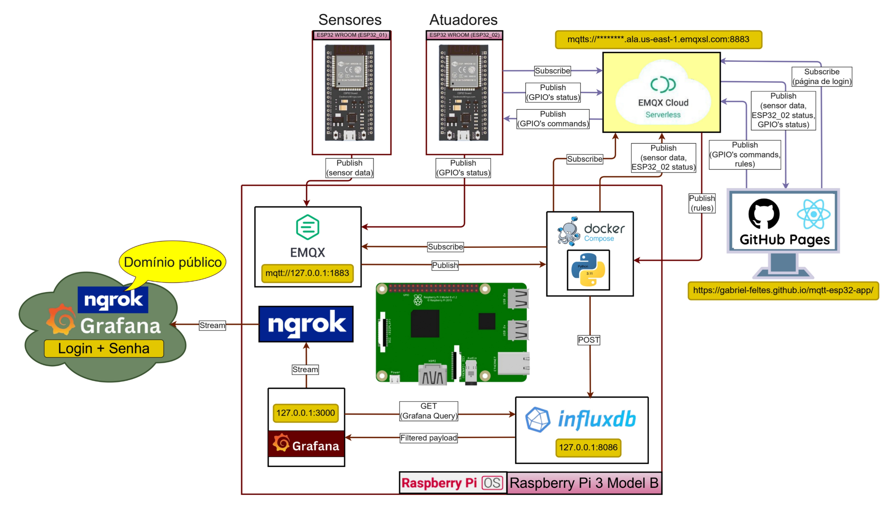

# Controle dos pinos GPIO do ESP32 via EMQX Cloud e Broker Local

Este projeto demonstra como transferir o controle dos pinos GPIO de um `ESP32-WROOM-32D` para um cliente `MQTT` na nuvem, utilizando o `EMQX Cloud`. Dessa forma, é possível acionar ou monitorar os pinos remotamente, além de criar regras automáticas baseadas nos dados dos sensores conectados ao ESP32. As regras podem ser configuradas diretamente no `EMQX Cloud`, permitindo ações autônomas sem a necessidade de intervenção manual, tornando o sistema mais flexível e inteligente.

## Introdução
O ESP32 é um microcontrolador versátil e poderoso, amplamente utilizado em projetos de Internet das Coisas (IoT). Este projeto utiliza o `EMQX Cloud Serverless` como broker MQTT para facilitar a comunicação entre o ESP32 e outros dispositivos ou serviços na nuvem. Através do `MQTT`, é possível enviar comandos para controlar os pinos GPIO do ESP32, bem como receber dados de sensores conectados a ele. Decidiu-se utilizar um broker local em um `Raspberry OS` rodando sobre um `Rasoberry Pi 3 Model B` para monitorar o tráfego de mensagens MQTT e gravar os dados em um banco de dados, permitindo o registro histórico e a análise posterior.

> [!NOTE]
> A pasta [`General_Purpose_IoT`](General_Purpose_IoT) contém o código-fonte para dispositivos embarcados (`ESP32-WROOM-32` e `Raspberry Pi 3 Model B`) que utilizam `MQTT` para comunicação com `brokers EMQX`, na nuvem ou localmente. Os códigos estão organizados por dispositivo, simplificando a navegação. Veja a topologia de rede do projeto, criada no [**`draw.io`**](https://app.diagrams.net/):  
> 
> Observe a protoboard do componente **`ESP32_01`**, que contém o `LED RGB`, o sensor `DHT11`, o sensor `MQ135`, o sensor `BMP280` e o sensor de luminosidade, todos conectados ao `ESP32-WROOM-32D`. O `LED RGB` é utilizado para debugar os limites de luminosidade.
> 
> Observe o esquema elétrico do componente **`ESP32_01`**, gerado pelo [**`Fritzing`**](https://fritzing.org/home/):
> 

## Pré-requisitos

- **Conta no EMQX Cloud**: Para utilizar o broker MQTT na nuvem (tutorial completo em [General_Purpose_IoT/README.md](/General_Purpose_IoT/README.md))
- **Hardware**:
  - **`ESP32-WROOM-32D (2 unidades)`**: Microcontrolador com suporte a Wi-Fi e Bluetooth
  - **`Raspberry Pi 3 Model B`**: Para rodar o broker MQTT local e monitorar o tráfego de mensagens
  - **`Sensor de Temperatura e Umidade DHT11`**: Para coletar dados ambientais
  - **`LED`**: Para demonstração de controle via MQTT
  - **Sensor de Gás MQ135**: Para detecção de CO2 com base nos parâmetros para esse tipo de gás
  - **`Sensor de Pressão BMP280`**: Para medir pressão atmosférica e temperatura
  - **`Sensor de luminosidade`**: Para medir a intensidade da luz ambiente
  - **`LED RGB`**: Para debugar os limites de luminosidade
  - **`Resistores de 10k`**: Para o sensor DHT11 e o sensor de luminosidade
  - **`Resistor de 220 ohms`**: Para o LED que debuga o controle remoto dos pinos GPIO
- **Software**:
  - **`ESP-IDF`**: Ambiente de desenvolvimento para ESP32
  - **`EMQX Cloud Serverless`**: Broker MQTT na nuvem
  - **`EMQX Broker Local`**: Broker MQTT local rodando no Raspberry Pi
  - **`Banco de Dados InfluxDB`**: Para armazenar os dados coletados dos sensores
  - **`Grafana`**: Para visualização dos dados armazenados no InfluxDB
  - **`ReactJS`**: Para criar uma interface web que permite o controle dos pinos GPIO do ESP32 e a visualização em tempo real dos dados dos sensores
  - **`Python`**: Para o script que coleta dados do broker local e os armazena no InfluxDB, mandando também os dados dos sensores para a interface web em tempo real
  - **`Docker com Docker Compose`**: Deixar o script Python mais fácil de ser executado, sem a necessidade de instalar as dependências manualmente e mantendo a execução do script em segundo plano
  - **`Ngrok`**: Para expor a interface do Grafana para a internet, permitindo o acesso remoto e a visualização dos dados em tempo real

## Requisitos Funcionais

- **`Controle Remoto dos Pinos GPIO`**: Permitir o controle remoto dos pinos GPIO do ESP32 via MQTT, utilizando o EMQX Cloud.
- **`Monitoramento de Sensores`**: Coletar dados de sensores conectados ao ESP32 e enviar esses dados para o broker MQTT.
- **`Regras Automáticas`**: Configurar regras automáticas no EMQX Cloud para acionar ou monitorar os pinos GPIO com base nos dados dos sensores.
- **`Interface Web`**: Criar uma interface web para visualizar os dados dos sensores em tempo real e controlar os pinos GPIO do ESP32.
- **`Armazenamento de Dados`**: Armazenar os dados coletados dos sensores em um banco de dados InfluxDB para análise posterior.
- **`Visualização de Dados`**: Utilizar o Grafana para visualizar os dados armazenados no InfluxDB, permitindo a criação de dashboards personalizados.
- **`Exposição da Interface Web`**: Utilizar o Ngrok para expor a interface do Grafana para a internet, permitindo o acesso remoto e a visualização dos dados em tempo real.

## Requisitos Não Funcionais

- **`Segurança`**: Implementar medidas de segurança para proteger a comunicação entre o ESP32, o broker MQTT e a interface web.
- **`Escalabilidade`**: O sistema deve ser escalável, permitindo a adição de novos sensores e atuadores sem a necessidade de grandes modificações no código existente.
- **`Manutenibilidade`**: O código deve ser modular e bem documentado, facilitando a manutenção e futuras expansões do sistema.
- **`Desempenho`**: O sistema deve ser capaz de lidar com múltiplas conexões simultâneas e responder rapidamente aos comandos enviados via MQTT.
- **`Compatibilidade`**: O sistema deve ser compatível com diferentes versões do ESP-IDF e bibliotecas utilizadas, garantindo que possa ser executado em diferentes ambientes de desenvolvimento.